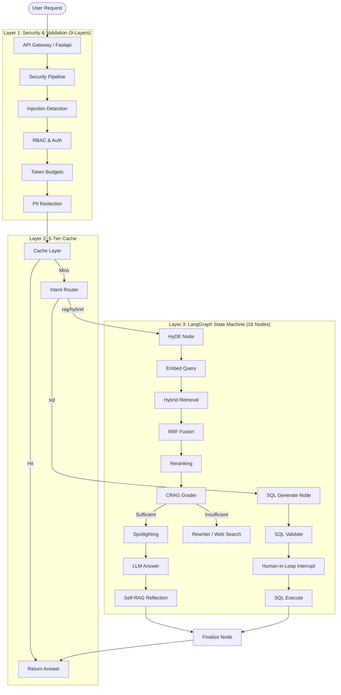

# Enterprise Advanced RAG — Kubernetes SRE Copilot

A production-grade AI copilot designed for Kubernetes and IT-operations teams. This is not a simple tutorial RAG; it is a full-fledged enterprise system featuring a robust 11-layer architecture. 

It handles complex observability queries, automates diagnosis of Kubernetes cluster states, and serves as an intelligent SRE assistant capable of both deep document retrieval and direct Text2SQL database interrogation.

## Architecture



## System Components

### 5-Tier Redis Caching
1. **Dense Cache**: Exact semantic matching.
2. **Intent Cache**: Caches router decisions.
3. **SQL Cache**: Caches generated SQL statements.
4. **SQL-result Cache**: Caches executed DB results.
5. **Answer Cache**: Final LLM generation cache.

### 9-Layer Input Security Pipeline
1. **Injection Detection**: Uses LLM-Guard to prevent prompt injections.
2. **RBAC & Auth**: Verifies JWT tokens and roles.
3. **Token Budgets**: Prevents abuse by limiting token consumption per user.
4. **PII Redaction**: Presidio-based redaction of sensitive entities.
5. **Rate Limiting**: IP and User-based request throttling.
6. **Toxic Content Filtering**: Blocks malicious or toxic inputs.
7. **Jailbreak Detection**: Detects sophisticated jailbreak attempts.
8. **Secrets Scanner**: Ensures no API keys or passwords are leaked in prompts.
9. **Payload Validation**: Strict Pydantic schemas for all inputs.

### 17-Node LangGraph State Machine
The core intelligence is driven by a 17-node LangGraph workflow:
1. `intent_router`: Routes to RAG, SQL, or direct answer.
2. `hyde`: Generates Hypothetical Document Embeddings for better recall.
3. `embed_query`: Converts queries to dense vectors.
4. `hybrid_retrieval`: Combines Dense (Qdrant) and Sparse (BM25) search.
5. `rrf`: Reciprocal Rank Fusion of hybrid results.
6. `rerank`: Cross-encoder reranking (FlashRank).
7. `crag_grader`: Corrective RAG grading of retrieved context.
8. `tavily_search`: Web search fallback for missing context.
9. `spotlighting`: Highlights key facts in long contexts.
10. `rewriter`: Rewrites queries if retrieval fails.
11. `sql_generate`: Text2SQL generation for structured data.
12. `sql_validate`: Validates generated SQL against schema.
13. `sql_interrupt`: Human-in-the-loop approval before execution.
14. `sql_execute`: Safe execution of read-only queries.
15. `llm_answer`: Final LLM generation based on context.
16. `self_rag_reflect`: Evaluates its own answer for hallucinations.
17. `finalize`: Formats the final output.

## Setup

### Prerequisites
- **Python**: Version 3.10 or higher.
- **Docker & Docker Compose**: Must be installed and running on your machine to provision local infrastructure (DB, Qdrant, Redis).

1. **Install dependencies**:
   ```bash
   pip install -r requirements.txt
   ```

2. **Environment Setup**:
   Copy `.env.example` to `.env` and fill in the required keys (OpenAI is minimum).

3. **Start Infrastructure**:
   ```bash
   docker-compose -f docker/docker-compose.local.yml up -d db qdrant redis
   ```

4. **Run DB Migrations**:
   ```bash
   alembic upgrade head
   ```

5. **Start API**:
   ```bash
   uvicorn src.api.main:app --reload
   ```

6. **Start Streamlit UI**:
   ```bash
   streamlit run app/chat_ui.py
   ```
   *The Admin Dashboard is available via `streamlit run app/admin_dashboard.py`*

## Ingesting Data
Use the ingestion script to populate Qdrant and the BM25 index:
```python
from src.ingestion.pipeline import IngestionPipeline
import asyncio

asyncio.run(IngestionPipeline.run("path/to/docs"))
```

## API Reference

- `GET /health` : Liveness probe.
- `GET /ready` : Readiness probe (checks DB/Redis).
- `POST /query` : Synchronous RAG query.
  - **Body**: `{"query": "string", "session_id": "uuid"}`
  - **Headers**: `Authorization: Bearer <token>`
- `POST /query/stream` : Server-Sent Events (SSE) streaming endpoint.
  - **Body**: `{"query": "string", "session_id": "uuid"}`
  - **Headers**: `Authorization: Bearer <token>`
